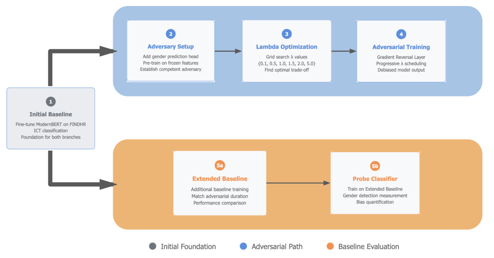
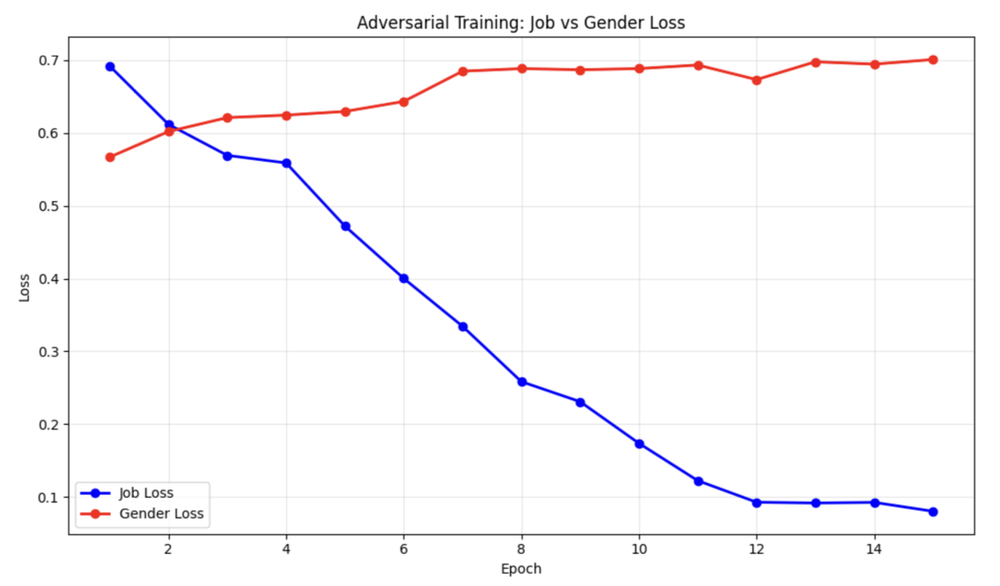

# Adversarial Debiasing for Fair Resume Screening
**Master's Thesis Project 2025**

[](https://www.python.org/downloads/)
[](https://opensource.org/licenses/MIT)
[](Master_Thesis_MG.pdf)

This repository contains the adversarial training implementation (Phase 3) from my thesis on fairness in transformers-based hiring algorithms.


## About This Project
AI resume screeners learn bias from historical data. Even after removing names and obvious gender markers, these systems can still infer gender from writing style, career gaps, and job terminology - then use that information to make biased decisions.

**This code implements adversarial training between a gender predictor NN and a resume classifier created from ModernBERT. The architecture uses a Gradient Reversal Layer to force competing gradients during backpropagation. The intensity of the debiasing gradient is regulated by a constant λ, optimization via grid search.
After training the transformer classifier learns job predictions that are uninformative for the adversary gender detector, creating representations that don't encode protected attributes**
**Results:** Gender predictability dropped from 63% to 51% (essentially random guessing) while maintaining 98% of classification performance. 

> [!NOTE]
> **The Full Thesis:** You can read the complete research and methodology in the [Master_Thesis_MG.pdf](./Master_Thesis_MG.pdf).

---

## Architecture

### The 4-Stage Pipeline
1. **Stage 1: Baseline** - Standard ICT classifier (ModernBERT encoder + linear classifier). Establishes performance ceiling before debiasing.
2. **Stage 2: Adversary Pre-training** - Train a gender classifier on frozen encoder features. Reaches ~68% accuracy on gender prediction.
3. **Stage 3: Lambda Optimization** - Grid search over $\lambda \in \{0.1, 0.5, 1.0, 2.0, 5.0\}$ to find the sweet spot. Optimal: $\lambda=2.0$.
4. **Stage 4: Adversarial Training** - Full training with Gradient Reversal Layer.



## Core Components

```text
src/
├── models/
│   ├── modernbert.py          # 768-dim encoder (ModernBERT-base)
│   ├── gradient_reversal.py   # GRL: reverses gradients in backprop
│   ├── adversarial.py         # Full adversarial architecture
│   └── probe.py               # Measures bias in frozen features
├── training/
│   ├── baseline.py            # Standard classifier training
│   ├── adversarial_trainer.py # 4-stage pipeline implementation
│   ├── lambda_optimization.py # Fairness-utility trade-off search
│   └── probe_trainer.py       # Baseline bias measurement
└── evaluation/
    ├── metrics.py             # F1, demographic parity, etc.
    └── visualization.py       # Training curves, confusion matrices
```

## Why No Dataset?
>[!IMPORTANT] The data contains protected attributes (gender, ethnicity, age) matched with real resume text. Publishing this would:

* **Violate the data donation consent.**

* **Risk re-identification despite anonymization (Phase 1 proved this is possible).** 

* **Potentially enable training of discriminatory systems.**

* **The European GDPR and AI Act have strict rules about processing special category data. This code respects that.**

---

## Running the Code
**Data Format**
The code expects CSV files with this structure:

```csv
id,full_text_english,gender,ict_label
1,"Software engineer with 5 years experience...",1,1
2,"Administrative assistant with organizational skills...",0,0
```
* `full_text_english`: Complete resume text (preprocessed, no PII)
* `gender`: 0=Female, 1=Male (binary only in this implementation)
* `ict_label`: 0=Non-ICT, 1=ICT

See `data_format.md` for detailed specifications.

* Installation and Training

```text
pip install -r requirements.txt

python scripts/train.py
```
This runs all 4 stages sequentially. Hyperparameters are in `configs/default.yaml`



---

## Results
Comparison on FINDHR test set:

| Metric | Baseline | Adversarial | Change | 
|--------|----------|-------------|--------|
| Job F1 Score | 0.6443 | 0.6287 | -2.4% |
|Job Accuracy | 64.88% | 63.69% | -1.2% |
|Gender Accuracy | 63.10% | 51.19% | -18.9% |
|Demographic Parity | 0.0147 | 0.0060 | -59% |

The model learns representations that genuinely don't contain gender information, rather than just hiding it with post-hoc corrections.

---

## Technical Details
The thesis [Master_Thesis_MG.pdf](./Master_Thesis_MG.pdf) contains in-depth explanations of:

* Gradient Reversal Layer mathematics
* Why ModernBERT over other encoders
* Progressive lambda scheduling rationale
* Statistical significance tests
* Linguistic pattern analysis from Phase 1
* Transfer learning challenges (Phase 2)
* Fairness definitions and trade-offs
* GDPR compliance considerations

All architectural decisions are justified with ablation studies and theoretical background.

---

* Citation 

```bibtex
@mastersthesis{giorgi2024adversarial,
  title={Adversarial Debiasing in Resume Screening for ICT Positions},
  author={Giorgi, Matteo},
  year={2024},
  school={Universitat Pompeu Fabra},
  type={Master's thesis}
}
```

---

## License
MIT License - see LICENSE file

**Note on responsible use**: This code is intended for bias mitigation research. Using it to train discriminatory systems would be both unethical and illegal under EU law.


